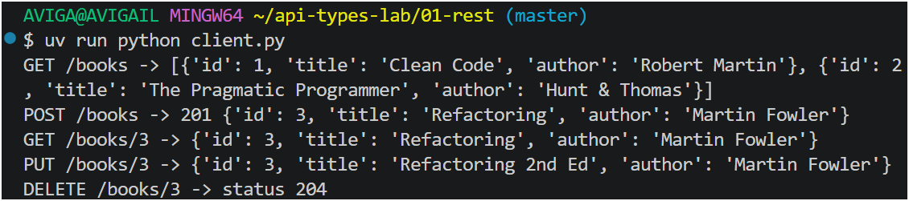
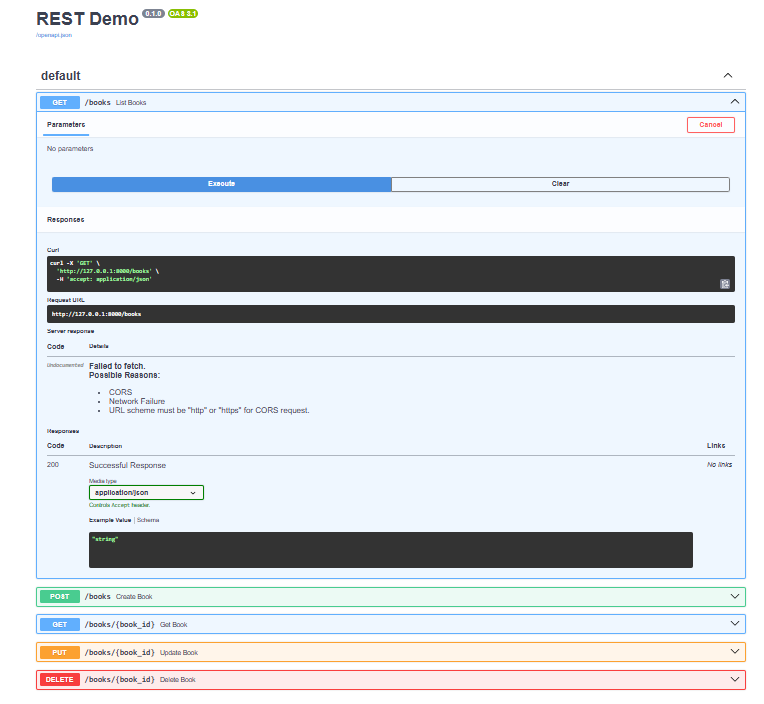
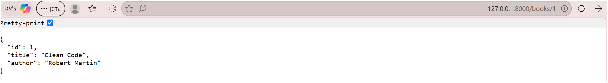

output:

AVIGA@AVIGAIL MINGW64 ~/api-types-lab/01-rest (master)
$ uv run python client.py
GET /books -> [{'id': 1, 'title': 'Clean Code', 'author': 'Robert Martin'}, {'id': 2, 'title': 'The Pragmatic Programmer', 'author': 'Hunt & Thomas'}]
POST /books -> 201 {'id': 3, 'title': 'Refactoring', 'author': 'Martin Fowler'}
GET /books/3 -> {'id': 3, 'title': 'Refactoring', 'author': 'Martin Fowler'}
PUT /books/3 -> {'id': 3, 'title': 'Refactoring 2nd Ed', 'author': 'Martin Fowler'}
DELETE /books/3 -> status 204
(api-types-lab) 
AVIGA@AVIGAIL MINGW64 ~/api-types-lab/01-rest (master)

---

---
