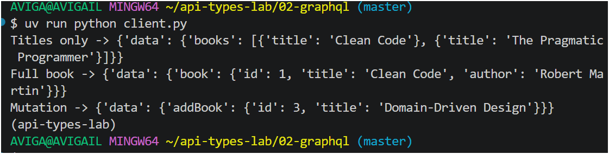
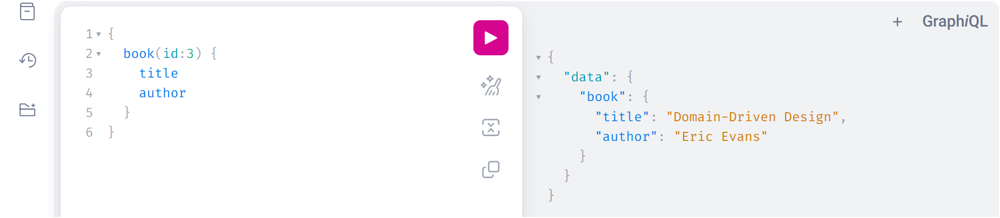

output:

AVIGA@AVIGAIL MINGW64 ~/api-types-lab/02-graphql (master)
$ uv run python client.py
Titles only -> {'data': {'books': [{'title': 'Clean Code'}, {'title': 'The Pragmatic Programmer'}]}}
Full book -> {'data': {'book': {'id': 1, 'title': 'Clean Code', 'author': 'Robert Martin'}}}
Mutation -> {'data': {'addBook': {'id': 3, 'title': 'Domain-Driven Design'}}}
(api-types-lab) 
AVIGA@AVIGAIL MINGW64 ~/api-types-lab/02-graphql (master)

---
