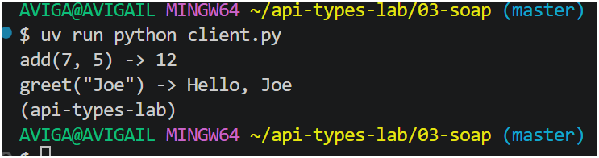
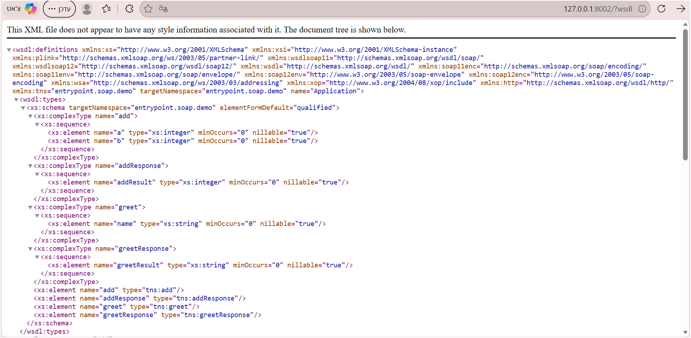

output:

AVIGA@AVIGAIL MINGW64 ~/api-types-lab/03-soap (master)
$ uv run python client.py
add(7, 5) -> 12
greet("Joe") -> Hello, Joe
(api-types-lab) 
AVIGA@AVIGAIL MINGW64 ~/api-types-lab/03-soap (master)

---

---

