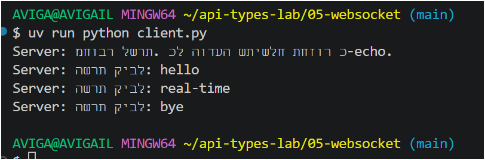
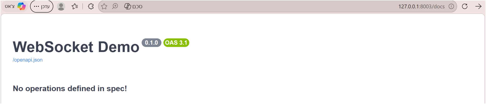

output:
AVIGA@AVIGAIL MINGW64 ~/api-types-lab/05-websocket (main)
$ uv run python client.py
Server: מחובר לשרת. כל הודעה שתישלח תחזור כ-echo.
Server: השרת קיבל: hello
Server: השרת קיבל: real-time
Server: השרת קיבל: bye
---

---

